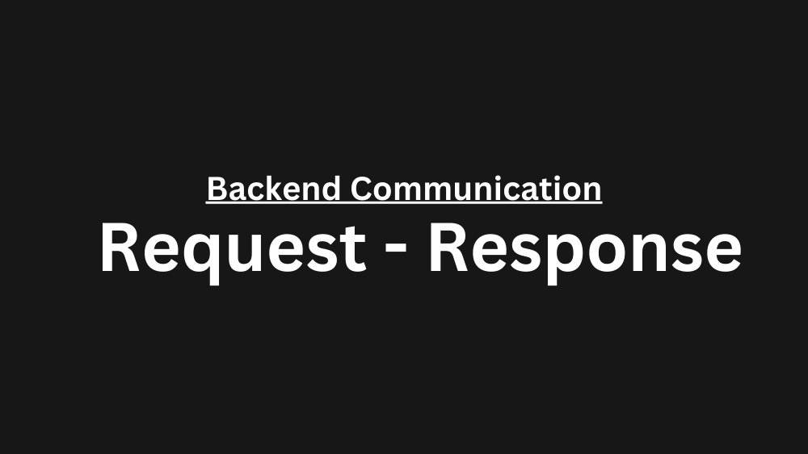

The request-response pattern is a simple and widely used communication model in backend systems. In this pattern, a client sends a request to a server, which processes it and returns a response. It’s fundamental to web protocols like HTTP and underpins most internet interactions. Its simplicity makes it easy to implement and understand, facilitating straightforward client-server communication.

## 1. Where is it used?
- **Web browsing**
  - When a user accesses a webpage, the browser (client) sends an HTTP GET request to the web server, which responds with the HTML content of the page.
- **APIs and Web Services**
  - RESTful APIs use HTTP methods (GET, POST, PUT, DELETE) to facilitate request-response interactions between clients and servers for resource manipulation.
- **Database Operations**
  - Applications send SQL queries to a database server and wait for the results before proceeding.
- **Remote Procedure Calls (RPC)**
  - Systems use RPC frameworks where functions are executed on a remote server as if they were local calls, following the request-response model.


## 2. Anatomy of a Request-Response

Assume we have written our frontend application using [React.js](https://react.dev/) and in other hand we have a backend application written in [Java](https://www.java.com/en/). Then why can't we have problem with our backend / frontend as they are written in different languages 🤔? So, it should be something that fills between them.

This is where **Protocol** comes into picture. Protocol is a set of rules that define how frontend and backend can communicate with each other. More specifically, it defines how to encode the request and response data. So, frontend and backend can communicate with each other using different protocols like HTTP, WebSocket, GraphQL, etc and they are agreed upon by both parties.

Here is a stucture/format of a HTTP request:


```text
GET / HTTP/1.1
Host: http://google.com
Content-Type: application/json
```

## 3. Demo 

Let's see how we can send a request to [google.com](https://google.com) and get the response using `curl` command.


```text
curl -v --trace-ascii output.txt http://google.com
```

How this command works?
- -v: Operate in verbose mode, providing detailed information about the request and response process.
- --trace-ascii output.txt: Record a trace of the entire request and response in ASCII format to output.txt.
- http://google.com: The URL you are sending the HTTP request to.

The output file output.txt contains a step-by-step trace of the HTTP communication between your machine and Google’s server. Let’s break down this trace to understand what’s happening under the hood.


```text
$ cat output.txt

== Info: Host google.com:80 was resolved.
== Info: IPv6: 2404:6800:4009:82a::200e
== Info: IPv4: 142.250.192.238
== Info:   Trying [2404:6800:4009:82a::200e]:80...
== Info: Connected to google.com (2404:6800:4009:82a::200e) port 80
=> Send header, 73 bytes (0x49)
0000: GET / HTTP/1.1
0010: Host: google.com
0022: User-Agent: curl/8.7.1
003a: Accept: */*
0047:
== Info: Request completely sent off
<= Recv header, 32 bytes (0x20)
0000: HTTP/1.1 301 Moved Permanently
<= Recv header, 34 bytes (0x22)
0000: Location: http://www.google.com/
<= Recv header, 40 bytes (0x28)
0000: Content-Type: text/html; charset=UTF-8
<= Recv header, 245 bytes (0xf5)
0000: Content-Security-Policy-Report-Only: object-src 'none';base-uri
0040: 'self';script-src 'nonce-Lz7g3dhEcHGypceYsMixzQ' 'strict-dynamic
0080: ' 'report-sample' 'unsafe-eval' 'unsafe-inline' https: http:;rep
00c0: ort-uri https://csp.withgoogle.com/csp/gws/other-hp
<= Recv header, 37 bytes (0x25)
0000: Date: Sat, 09 Nov 2024 10:30:30 GMT
<= Recv header, 40 bytes (0x28)
0000: Expires: Mon, 09 Dec 2024 10:30:30 GMT
<= Recv header, 40 bytes (0x28)
0000: Cache-Control: public, max-age=2592000
<= Recv header, 13 bytes (0xd)
0000: Server: gws
<= Recv header, 21 bytes (0x15)
0000: Content-Length: 219
<= Recv header, 21 bytes (0x15)
0000: X-XSS-Protection: 0
<= Recv header, 29 bytes (0x1d)
0000: X-Frame-Options: SAMEORIGIN
<= Recv header, 2 bytes (0x2)
0000:
<= Recv data, 219 bytes (0xdb)
0000: <HTML><HEAD><meta http-equiv="content-type" content="text/html;c
0040: harset=utf-8">.<TITLE>301 Moved</TITLE></HEAD><BODY>.<H1>301 Mov
0080: ed</H1>.The document has moved.<A HREF="http://www.google.com/">
00c0: here</A>.
00cb: </BODY></HTML>
== Info: Connection #0 to host google.com left intact
```
Here is the breakdown of the trace:

1. **Connection Setup:**
   - The curl command establishes a connection to google.com and sends a GET request to the root URL (`/`). It is able to resolve the IP address of the server using DNS lookup. 
   - The connection is made using IPv6 address `2404:6800:4009:82a::200e` and port `80`.

2. **Request Headers:**
   - The request headers are sent to the server.
   - The request method is `GET` and the HTTP version is `HTTP/1.1`.
   - The `Host` header specifies the domain name of the server.
   - The `User-Agent` header identifies the client making the request, in this case, curl.
   - The `Accept` header indicates that the client can accept any content type.
  
3. **Response Headers:**
   - The response headers are received from the server.
   - The response status code is `301 Moved Permanently`.
   - The `Location` header specifies the URL to which the client should be redirected.
   - The `Content-Type` header indicates the type of content being returned.
   - Then we have some more headers like `Date`, `Expires`, `Cache-Control`, `Server`, `Content-Length`, `X-XSS-Protection`, `X-Frame-Options`, etc.

4. **Response Body/Data:**
   - The response body contains the HTML content of the page.


And that's it! We have successfully sent a request to google.com and received the response. Thanks for reading! Feel free to connect with me on [LinkedIn](https://www.linkedin.com/in/devhardik/).

